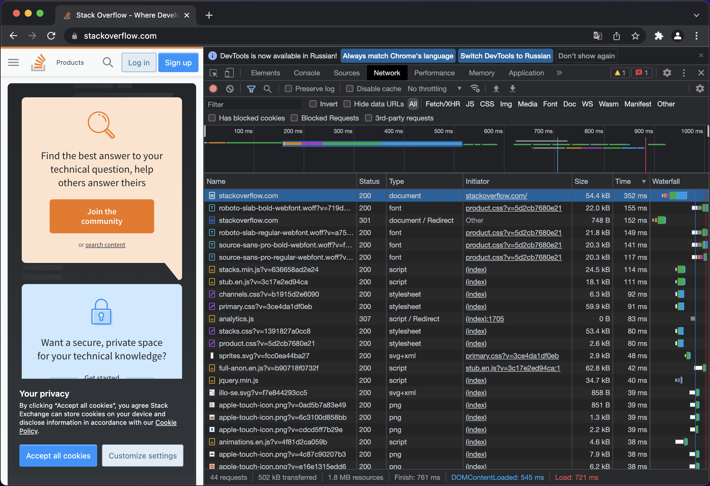

# Домашнее задание к занятию "3.6. Компьютерные сети, лекция 1"

## Задание 1

Код ответа HTTP [301 Moved Permanently](https://datatracker.ietf.org/doc/html/rfc2616#section-10.3.2) — запрошенный документ был окончательно перенесен на новый URI, указанный в поле *location* заголовка.

`telnet stackoverflow.com 80`
```
Trying 151.101.193.69...
Connected to stackoverflow.com.
Escape character is '^]'.
GET /questions HTTP/1.0
HOST: stackoverflow.com

HTTP/1.1 301 Moved Permanently
cache-control: no-cache, no-store, must-revalidate
location: https://stackoverflow.com/questions
x-request-guid: 74f9ee22-4746-420a-8427-e8e8880f3b2c
feature-policy: microphone 'none'; speaker 'none'
content-security-policy: upgrade-insecure-requests; frame-ancestors 'self' https://stackexchange.com
Accept-Ranges: bytes
Date: Tue, 15 Feb 2022 11:47:10 GMT
Via: 1.1 varnish
Connection: close
X-Served-By: cache-hhn4081-HHN
X-Cache: MISS
X-Cache-Hits: 0
X-Timer: S1644925630.399696,VS0,VE155
Vary: Fastly-SSL
X-DNS-Prefetch-Control: off
Set-Cookie: prov=732b6252-2262-0575-b05e-c3271895a6b4; domain=.stackoverflow.com; expires=Fri, 01-Jan-2055 00:00:00 GMT; path=/; HttpOnly

Connection closed by foreign host.
```

## Задание 2

Код ответа HTTP 301 Moved Permanently

```
HTTP/1.1 301 Moved Permanently
cache-control: no-cache, no-store, must-revalidate
location: https://stackoverflow.com/
x-request-guid: c6b883b7-7572-4572-a63e-bda2c8d902c5
feature-policy: microphone 'none'; speaker 'none'
content-security-policy: upgrade-insecure-requests; frame-ancestors 'self' https://stackexchange.com
Transfer-Encoding: chunked
Accept-Ranges: bytes
Date: Tue, 15 Feb 2022 12:02:20 GMT
Via: 1.1 varnish
Connection: keep-alive
X-Served-By: cache-hhn4081-HHN
X-Cache: MISS
X-Cache-Hits: 0
X-Timer: S1644926540.332099,VS0,VE78
Vary: Fastly-SSL
X-DNS-Prefetch-Control: off
Set-Cookie: prov=f3f8955f-9502-c114-c8f7-25e34f51a740; domain=.stackoverflow.com; expires=Fri, 01-Jan-2055 00:00:00 GMT; path=/; HttpOnly
```

Дольше всего выполнялся GET-запрос на URL из поля *location* ответа 301 Moved Permanently.



## Задание 3

Мой внешний IP адрес

`curl https://api.ipify.org`
```
185.97.201.113
```

## Задание 4

IP-адрес принадлежит провайдеру П.А.К.Т, AS39087

`whois 185.97.201.113 | grep org-name`
```
org-name:       P.A.K.T LLC
```
`whois 185.97.201.113 | grep origin`
```
origin:         AS39087
```

## Задание 5

`sudo traceroute -Ani eth1 8.8.8.8`
```
traceroute to 8.8.8.8 (8.8.8.8), 30 hops max, 60 byte packets
 1  192.168.88.1 [*]  2.799 ms  2.865 ms  2.583 ms
 2  10.36.20.1 [*]  5.638 ms  6.035 ms  6.415 ms
 3  10.37.6.177 [*]  3.465 ms  3.386 ms  3.288 ms
 4  10.37.0.213 [*]  8.206 ms  8.180 ms  8.055 ms
 5  10.37.131.209 [*]  3.505 ms  3.449 ms  3.357 ms
 6  10.37.5.85 [*]  3.485 ms  3.459 ms *
 7  10.37.129.187 [*]  5.022 ms  5.012 ms  5.001 ms
 8  209.85.148.36 [AS15169]  6.002 ms  5.812 ms  5.745 ms
 9  74.125.244.132 [AS15169]  5.566 ms 74.125.244.180 [AS15169]  5.464 ms  5.408 ms
10  72.14.232.85 [AS15169]  6.233 ms 142.251.61.219 [AS15169]  9.109 ms  9.433 ms
11  142.250.210.103 [AS15169]  9.374 ms 142.251.51.187 [AS15169]  8.618 ms 216.239.42.21 [AS15169]  9.119 ms
12  142.250.209.35 [AS15169]  12.540 ms * *
13  * * *
14  * * *
15  * * *
16  * * *
17  * * *
18  * * *
19  * * *
20  * * *
21  8.8.8.8 [AS15169]  8.259 ms  7.871 ms  8.088 ms
```

## Задание 6

Наибольшая задержка на узле с IP-адресом 172.253.51.185 (Google LLC)

`mtr -znI eth1 8.8.8.8`
```
                                       My traceroute  [v0.93]
vagrant (192.168.88.234)                                                   2022-02-15T06:25:18-0800
Keys:  Help   Display mode   Restart statistics   Order of fields   quit
                                                           Packets               Pings
 Host                                                    Loss%   Snt   Last   Avg  Best  Wrst StDev
 1. AS???    192.168.88.1                                93.2%   250    2.7   3.1   2.1   6.0   1.1
 2. AS???    10.36.20.1                                  93.6%   250    5.9   4.6   3.7   5.9   0.7
 3. AS???    10.37.6.177                                 93.2%   250    5.1   4.7   3.4   8.9   1.5
 4. AS???    10.37.0.213                                 93.2%   250    4.3   4.8   3.1   7.8   1.4
 5. AS???    10.37.131.209                               93.2%   250    3.6   3.9   2.9   7.2   1.0
 6. AS???    10.37.5.85                                  92.8%   250    4.8   6.8   3.3  29.0   6.3
 7. AS???    10.37.129.187                               93.2%   250    5.3   5.2   3.5   7.3   1.1
 8. AS15169  209.85.148.36                               92.8%   250    4.7   7.4   3.9  26.3   5.2
 9. AS15169  74.125.244.132                              93.2%   250    8.2   5.3   3.6   8.4   1.6
10. AS15169  142.251.61.219                              92.8%   250   15.6   9.7   7.9  15.6   1.8
11. AS15169  172.253.51.185                              93.6%   250   12.5  12.0   8.6  16.5   2.5
12. (waiting for reply)
13. (waiting for reply)
14. (waiting for reply)
15. (waiting for reply)
16. (waiting for reply)
17. (waiting for reply)
18. (waiting for reply)
19. (waiting for reply)
20. (waiting for reply)
21. AS15169  8.8.8.8                                     93.4%   227   11.5   9.1   6.6  13.1   2.1
```

## Задание 7

`dig +trace dns.google`
```
dns.google.		10800	IN	NS	ns3.zdns.google.
dns.google.		10800	IN	NS	ns2.zdns.google.
dns.google.		10800	IN	NS	ns1.zdns.google.
dns.google.		10800	IN	NS	ns4.zdns.google.
dns.google.		3600	IN	DS	56044 8 2 1B0A7E90AA6B1AC65AA5B573EFC44ABF6CB2559444251B997103D2E4 0C351B08
dns.google.		3600	IN	RRSIG	DS 8 2 3600 20220305171116 20220211171116 39106 google. Cu27ometfUKfhQzo2Ks8qNROOkbXU7YpXQlredYRmxiEBggHy37QY1TM ZhY6RjUJTvOI5LtzKbPNV87jJ8rIJfXJFcgm62qLCqK7WnddD/z2wHcO AidLBWIT7uHaQORe3+4LDGkK8rtiw5tbflqL8NcCQay8O3fjRpIwWfFH Zyo=
;; Received 506 bytes from 216.239.60.105#53(ns-tld5.charlestonroadregistry.com) in 132 ms

dns.google.		900	IN	A	8.8.4.4
dns.google.		900	IN	A	8.8.8.8
dns.google.		900	IN	RRSIG	A 8 2 900 20220307120732 20220213120732 25800 dns.google. Kap8xUB2kuHwdtW+zn+rUsoEVQgtUhFV8D9ora+4xHxhmehohTvJ1ES9 cs1oq7igHDlfRTkw9F6LIhPoNXtGrPM8EANzL2MJ6DAZOTOuqsgHYiJ1 b6whTQUAuEUB6VxQ25ESSAg51RTvxfI+52P5ufb7Z9N0FzEk0z87viUv ovQ=
;; Received 241 bytes from 216.239.34.114#53(ns2.zdns.google) in 44 ms
```

## Задание 8

`dig -x 8.8.4.4`
```
; <<>> DiG 9.16.1-Ubuntu <<>> -x 8.8.4.4
;; global options: +cmd
;; Got answer:
;; ->>HEADER<<- opcode: QUERY, status: NOERROR, id: 41906
;; flags: qr rd ra; QUERY: 1, ANSWER: 1, AUTHORITY: 0, ADDITIONAL: 1

;; OPT PSEUDOSECTION:
; EDNS: version: 0, flags:; udp: 65494
;; QUESTION SECTION:
;4.4.8.8.in-addr.arpa.		IN	PTR

;; ANSWER SECTION:
4.4.8.8.in-addr.arpa.	978	IN	PTR	dns.google.

;; Query time: 12 msec
;; SERVER: 127.0.0.53#53(127.0.0.53)
;; WHEN: Tue Feb 15 11:44:07 PST 2022
;; MSG SIZE  rcvd: 73
```

`dig -x 8.8.8.8`
```
; <<>> DiG 9.16.1-Ubuntu <<>> -x 8.8.8.8
;; global options: +cmd
;; Got answer:
;; ->>HEADER<<- opcode: QUERY, status: NOERROR, id: 8031
;; flags: qr rd ra; QUERY: 1, ANSWER: 1, AUTHORITY: 0, ADDITIONAL: 1

;; OPT PSEUDOSECTION:
; EDNS: version: 0, flags:; udp: 65494
;; QUESTION SECTION:
;8.8.8.8.in-addr.arpa.		IN	PTR

;; ANSWER SECTION:
8.8.8.8.in-addr.arpa.	3600	IN	PTR	dns.google.

;; Query time: 128 msec
;; SERVER: 127.0.0.53#53(127.0.0.53)
;; WHEN: Tue Feb 15 11:44:18 PST 2022
;; MSG SIZE  rcvd: 73
```

