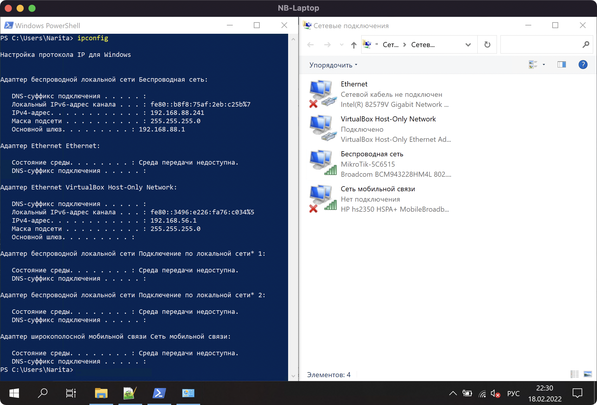

# Домашнее задание к занятию "3.7. Компьютерные сети, лекция 2"

## Задание 1

В Linux список сетевых интерфейсов можно посмотреть командой:

`ip link`
```
1: lo: <LOOPBACK,UP,LOWER_UP> mtu 65536 qdisc noqueue state UNKNOWN mode DEFAULT group default qlen 1000
    link/loopback 00:00:00:00:00:00 brd 00:00:00:00:00:00
2: eth0: <BROADCAST,MULTICAST,UP,LOWER_UP> mtu 1500 qdisc fq_codel state UP mode DEFAULT group default qlen 1000
    link/ether 00:1c:42:51:b8:31 brd ff:ff:ff:ff:ff:ff
3: eth1: <BROADCAST,MULTICAST> mtu 1500 qdisc fq_codel state DOWN mode DEFAULT group default qlen 1000
    link/ether 00:1c:42:bf:33:68 brd ff:ff:ff:ff:ff:ff
```

В Windows сетевые интерфейсы можно посмотреть командой `ipconfig` или в графическом интерфейсе в Панели управления.



## Задание 2

Для распознавания соседа по сетевому интерфейсу используется протокол LLDP.  
Для Linux есть пакет lldpd, команда lldpctl.

## Задание 3

Для разделения на виртуальные сети на уровне L2 используется VLAN.  
Для Linux есть пакет vlan и следующие основные команды:

Создать vlan на сетевом интерфейсе
```
root@vagrant:~# ip link add link eth0 name vlan100 type vlan id 100
root@vagrant:~# ip link show vlan100
4: vlan100@eth0: <BROADCAST,MULTICAST> mtu 1500 qdisc noop state DOWN mode DEFAULT group default qlen 1000
    link/ether 00:1c:42:51:b8:31 brd ff:ff:ff:ff:ff:ff
```

Настроить IP-адрес на интерфейсе типа vlan

```
root@vagrant:~# ip addr add 10.0.0.1/32 dev vlan100
root@vagrant:~# ip addr show dev vlan100
4: vlan100@eth0: <BROADCAST,MULTICAST> mtu 1500 qdisc noop state DOWN group default qlen 1000
    link/ether 00:1c:42:51:b8:31 brd ff:ff:ff:ff:ff:ff
    inet 10.0.0.1/32 scope global vlan100
       valid_lft forever preferred_lft forever
```

Поднять интерфейс типа vlan

```
root@vagrant:~# ip link set dev vlan100 up
root@vagrant:~# ip link show vlan100
4: vlan100@eth0: <BROADCAST,MULTICAST,UP,LOWER_UP> mtu 1500 qdisc noqueue state UP mode DEFAULT group default qlen 1000
    link/ether 00:1c:42:51:b8:31 brd ff:ff:ff:ff:ff:ff
root@vagrant:~# 
```

Пример файла конфигурации /etc/network/interfaces

```
auto vlan100
iface vlan100 inet static
        address 10.0.0.1
        netmask 255.255.255.255
        vlan_raw_device eth0
```

## Задание 4

Linux Bonding

Режимы

* mode=0 (balance-rr)
Round-robin - последовательно передаются пакеты с первого по последний интерфейс.
* mode=1 (active-backup)
Один из интерфейсов активен. Если активный интерфейс выходит из строя (link down и т.д.), другой интерфейс заменяет активный. Не требует дополнительной настройки коммутатора.
* mode=2 (balance-xor)
Передачи распределяются между интерфейсами на основе формулы ((MAC-адрес источника) XOR (MAC-адрес получателя)) % число интерфейсов. Один и тот же интерфейс работает с определённым получателем. Режим даёт балансировку нагрузки и отказоустойчивость.
* mode=3 (broadcast)
Все пакеты передаются на все интерфейсы. Обеспечивает отказоустойчивость.
* mode=4 (802.3ad)
IEEE 802.3ad Динамическая агрегация каналов. Создает группы агрегации с одинаковыми настройками скорости и дуплекса. Использует все ведомые устройства в активном агрегаторе в соответствии со спецификацией 802.3ad.
* mode=5 (balance-tlb)
Входящие пакеты принимаются только активным сетевым интерфейсом, исходящий распределяется в зависимости от текущей загрузки каждого интерфейса. Не требует настройки коммутатора.
* mode=6 (balance-alb)
Тоже самое что 5, только входящий трафик тоже распределяется между интерфейсами. Не требует настройки коммутатора, но интерфейсы должны уметь изменять MAC.

Пример конфигурации /etc/network/interfaces

```
auto bond0
iface bond0 inet static
    address 10.31.1.5
    netmask 255.255.255.0
    network 10.31.1.0
    gateway 10.31.1.254
    bond-slaves eth0 eth1
    bond-mode active-backup
    bond-miimon 100
    bond-downdelay 200
    bond-updelay 200
```

## Задание 5

В сети с маской /29 8 IP-адресов. Начальный IP-адрес используется для определения адреса сети, конечный – для широковещательной рассылки внутри этой сети.

Из сети /24 можно получить 32 подсети /29 `2^(29-24)=32`

```
root@vagrant:~# ipcalc 10.10.10.0/24 -b -s 6 6 6 | grep Network | grep /29
Network:   10.10.10.0/29        
Network:   10.10.10.8/29        
Network:   10.10.10.16/29  
```

## Задание 6

В данном случае допустимо использовать адреса из сети 100.64.0.0/10, предназначенной для Carrier-Grade NAT.

```
root@vagrant:~# ipcalc 100.64.0.0/10 -b -s 50 | grep Network | grep -v /10
Network:   100.64.0.0/26
```

## Задание 7

iproute2

```
root@vagrant:~# ip neigh
192.168.88.1 dev eth1 lladdr 08:55:31:5c:65:10 STALE
10.211.55.2 dev eth0 lladdr f2:2f:4b:b0:6b:64 DELAY
10.211.55.1 dev eth0 lladdr 00:1c:42:00:00:18 REACHABLE
fe80::21c:42ff:fe00:18 dev eth0 lladdr 00:1c:42:00:00:18 router STALE
```

Для удаления записей из ARP-таблицы использовать команду `ip neigh flush` с аргументом `all` для удаления всех записей или указать конкретный IP-адрес.

Использовать net-tools не имеет смысла.

