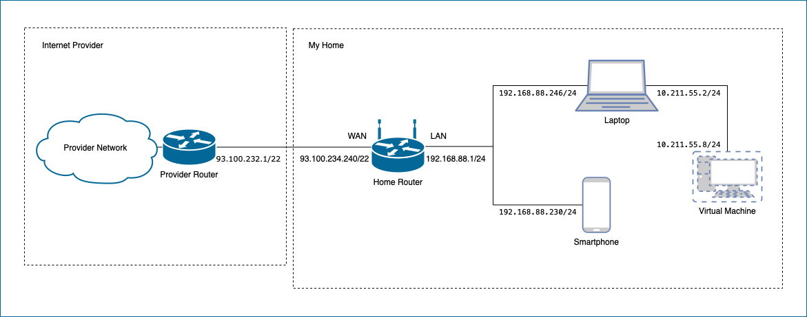

# Домашнее задание к занятию "3.8. Компьютерные сети, лекция 3"

## Задание 1

```
User Access Verification

Username: rviews
route-views>show ip route 93.100.234.240
Routing entry for 93.100.128.0/17
  Known via "bgp 6447", distance 20, metric 0
  Tag 8283, type external
  Last update from 94.142.247.3 5d06h ago
  Routing Descriptor Blocks:
  * 94.142.247.3, from 94.142.247.3, 5d06h ago
      Route metric is 0, traffic share count is 1
      AS Hops 4
      Route tag 8283
      MPLS label: none
route-views>show bgp 93.100.234.240
BGP routing table entry for 93.100.128.0/17, version 366812156
Paths: (2 available, best #2, table default)
  Not advertised to any peer
  Refresh Epoch 1
  3333 1103 20562 35807
    193.0.0.56 from 193.0.0.56 (193.0.0.56)
      Origin IGP, localpref 100, valid, external, atomic-aggregate
      Community: 20562:45 20562:3120 20562:4001 20562:65000 20562:65020
      path 7FE094290598 RPKI State not found
      rx pathid: 0, tx pathid: 0
  Refresh Epoch 1
  8283 15703 20562 35807
    94.142.247.3 from 94.142.247.3 (94.142.247.3)
      Origin IGP, metric 0, localpref 100, valid, external, atomic-aggregate, best
      Community: 8283:10 15703:652 15703:800 15703:65222 20562:45 20562:3120 20562:4001 20562:65000 20562:65020
      unknown transitive attribute: flag 0xE0 type 0x20 length 0xC
        value 0000 205B 0000 0006 0000 000A 
      path 7FE0BA9AFA50 RPKI State not found
      rx pathid: 0, tx pathid: 0x0
route-views>
```

## Задание 2

`sudo ip link add dummy0 type dummy`  
`sudo ip address add 192.168.255.1/32 dev dummy0`  
`sudo ip link set dummy0 up`  
`ip address show dummy0`

```
3: dummy0: <BROADCAST,NOARP,UP,LOWER_UP> mtu 1500 qdisc noqueue state UNKNOWN group default qlen 1000
    link/ether da:c6:9d:cc:8a:74 brd ff:ff:ff:ff:ff:ff
    inet 192.168.255.1/32 scope global dummy0
       valid_lft forever preferred_lft forever
    inet6 fe80::d8c6:9dff:fecc:8a74/64 scope link 
       valid_lft forever preferred_lft forever
```

`sudo ip route add 192.168.88.0/24 via 192.168.255.1`  
`sudo ip route add 10.0.0.0/24 dev dummy0`  
`ip route`

```
default via 10.211.55.1 dev eth0 proto dhcp src 10.211.55.8 metric 100 
10.0.0.0/24 dev dummy0 scope link 
10.211.55.0/24 dev eth0 proto kernel scope link src 10.211.55.8 
10.211.55.1 dev eth0 proto dhcp scope link src 10.211.55.8 metric 100 
192.168.88.0/24 via 192.168.255.1 dev dummy0 
```

## Задание 3

`sudo ss -tlpn`

```
State  Recv-Q Send-Q Local Address:Port  Peer Address:PortProcess                                   
LISTEN 0      4096   127.0.0.53%lo:53         0.0.0.0:*    users:(("systemd-resolve",pid=689,fd=13))
LISTEN 0      128          0.0.0.0:22         0.0.0.0:*    users:(("sshd",pid=793,fd=3))            
LISTEN 0      4096       127.0.0.1:8125       0.0.0.0:*    users:(("netdata",pid=716,fd=42))        
LISTEN 0      4096         0.0.0.0:19999      0.0.0.0:*    users:(("netdata",pid=716,fd=4))         
LISTEN 0      4096               *:9100             *:*    users:(("node_exporter",pid=718,fd=3))   
LISTEN 0      4096               *:5201             *:*    users:(("iperf3",pid=2045,fd=3))         
LISTEN 0      128             [::]:22            [::]:*    users:(("sshd",pid=793,fd=4))         
```

## Задание 4

`sudo ss -upn`

```
Recv-Q      Send-Q            Local Address:Port                Peer Address:Port      Process      
0           0                   10.211.55.8:50263             35.176.132.167:5201       users:(("iperf3",pid=2853,fd=5))
```

## Задание 5

L3-диаграмма домашней сети



## Задание 6*

В качестве тестирования балансировки использовал подключение по SSH до двух VPS на Amazon с публичными IP-адресами 18.130.118.72 и 35.176.132.167.

Установил nginx на ВМ (IP-адрес 10.211.55.8), развернутой на локальном ноутбуке (10.211.55.2).

`sudo apt install nginx`

Добавил в файл конфигурации /etc/nginx/nginx.conf следующие строчки

```
stream {
  upstream ssh_servers {
    server 18.130.118.72:22;
    server 35.176.132.167:22;
  }

  server {
    listen 2229;
    proxy_pass ssh_servers;
  }
}
```

Выполнил проверку конфига и перезагрузил конфиг nginx

`sudo nginx -t`

```
nginx: the configuration file /etc/nginx/nginx.conf syntax is ok
nginx: configuration file /etc/nginx/nginx.conf test is successful
```

`sudo systemctl reload nginx`

Добавил на ноубтуке в файл конфига SSH ~/.ssh/config следующие строчки
```
Host nginxTest
    HostName 10.211.55.8
    Port 2229
    User ubuntu
    IdentityFile ~/.ssh/eu-west-2.pem
    StrictHostKeyChecking no
    UserKnownHostsFile=/dev/null
```

Выполнил два подключения к одному хосту 10.211.55.8

```
sayboo@MacBook-Pro-sayboo ~ % ssh nginxTest 'curl -s https://api.ipify.org'
Warning: Permanently added '[10.211.55.8]:2229' (ED25519) to the list of known hosts.
18.130.118.72% 
sayboo@MacBook-Pro-sayboo ~ % ssh nginxTest 'curl -s https://api.ipify.org'
Warning: Permanently added '[10.211.55.8]:2229' (ED25519) to the list of known hosts.
35.176.132.167% 
```

Видно, что балансировка работает.