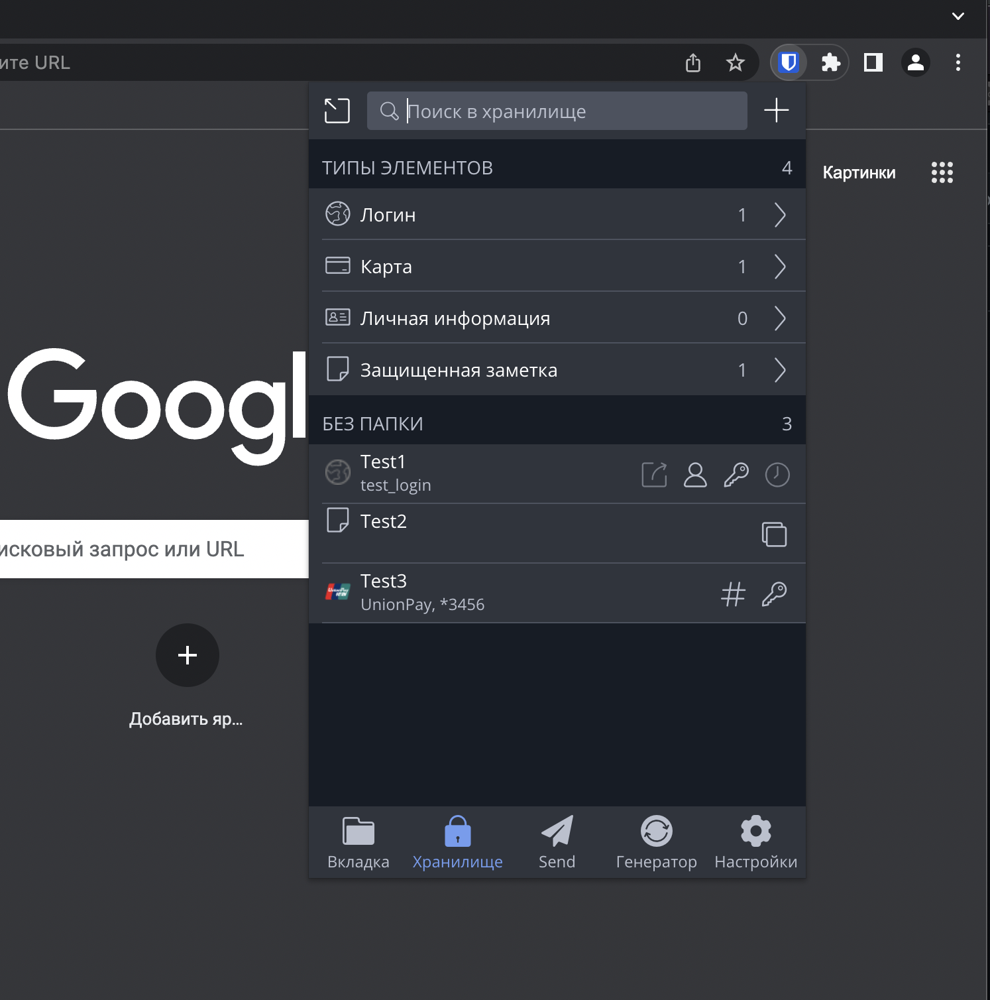
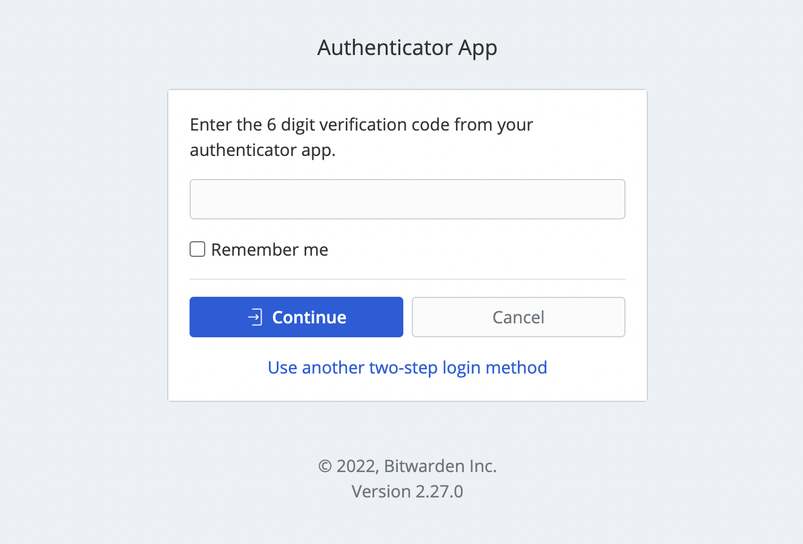
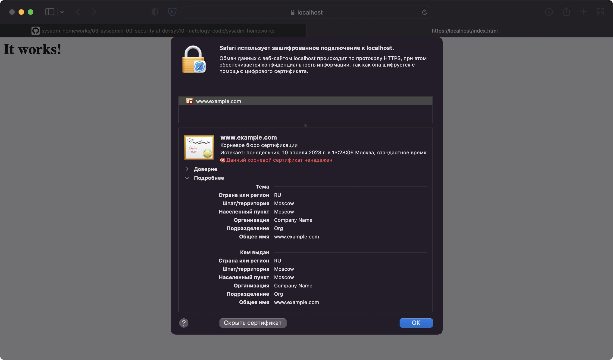
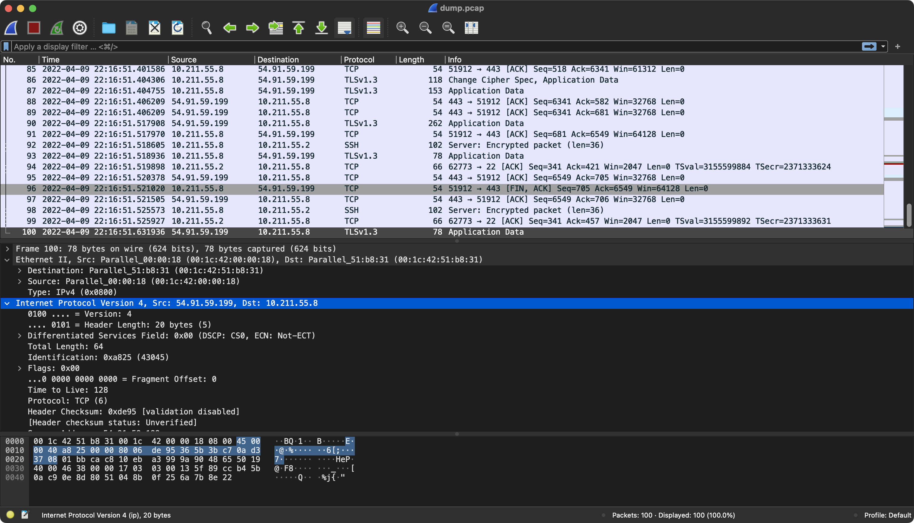

# Домашнее задание к занятию "3.9. Элементы безопасности информационных систем"

## Задание 1

Установил плагин Bitwarden в Google Chrome, зарегестрировался и создал несколько тестовых секретов.



## Задание 2

Настроил двухфакторную авторизацию в Bitwarden с помощью Google Authenticator.



## Задание 3

Для выполнения задания создал отдельную ВМ, пробросил порт 443

`cat Vagrantfile`

```
Vagrant.configure("2") do |config|
  config.vm.box = "bento/ubuntu-20.04-arm64"
  config.vm.box_version = "202112.19.0"
  config.vm.box_check_update=false
  config.vm.hostname = "vm4apache"
  config.vm.provider "parallels" do |prl|
    prl.memory = 1024
    prl.cpus = 1
    prl.update_guest_tools = false
  end
  config.vm.network "forwarded_port", guest: 443, host: 443
end
```

`sudo apt install apache2`

`sudo a2enmod ssl`

```
Considering dependency setenvif for ssl:
Module setenvif already enabled
Considering dependency mime for ssl:
Module mime already enabled
Considering dependency socache_shmcb for ssl:
Enabling module socache_shmcb.
Enabling module ssl.
See /usr/share/doc/apache2/README.Debian.gz on how to configure SSL and create self-signed certificates.
To activate the new configuration, you need to run:
  systemctl restart apache2
```

`sudo systemctl restart apache2`

```
sudo openssl req -x509 -nodes -days 365 -newkey rsa:2048 \
-keyout /etc/ssl/private/apache-selfsigned.key \
-out /etc/ssl/certs/apache-selfsigned.crt \
-subj "/C=RU/ST=Moscow/L=Moscow/O=Company Name/OU=Org/CN=www.example.com"
```

```
Generating a RSA private key
.....+++++
.....................................................................................................+++++
writing new private key to '/etc/ssl/private/apache-selfsigned.key'
-----
```

`cat /etc/apache2/sites-available/10-211-55-11.conf`

```
<VirtualHost *:443>
   ServerName 10.211.55.11
   DocumentRoot /var/www/10.211.55.11
   SSLEngine on
   SSLCertificateFile /etc/ssl/certs/apache-selfsigned.crt
   SSLCertificateKeyFile /etc/ssl/private/apache-selfsigned.key
</VirtualHost>
```

`cat /var/www/10.211.55.11/index.html`

```
<h1>It works!</h1>
```

`sudo a2ensite 10-211-55-11.conf`

```
Enabling site 10-211-55-11.
To activate the new configuration, you need to run:
  systemctl reload apache2
```

`sudo apache2ctl configtest`

```
AH00558: apache2: Could not reliably determine the server's fully qualified domain name, using 127.0.2.1. Set the 'ServerName' directive globally to suppress this message
Syntax OK
```

`sudo systemctl reload apache2`

Открыл в браузере страницу https://localhost/index.html



## Задание 4

Проверил на уязвимости TLS сайт https://remote.vtb.ru

`./testssl.sh -U --sneaky https://remote.vtb.ru`

```
###########################################################
    testssl.sh       3.1dev from https://testssl.sh/dev/
    (e821787 2022-04-07 21:29:20 -- )

      This program is free software. Distribution and
             modification under GPLv2 permitted.
      USAGE w/o ANY WARRANTY. USE IT AT YOUR OWN RISK!

       Please file bugs @ https://testssl.sh/bugs/

###########################################################

 Using "LibreSSL 2.8.3" [~69 ciphers]
 on MacBook-Pro-sayboo:/usr/bin/openssl
 (built: "date not available", platform: "information not available")


 Start 2022-04-09 22:50:48        -->> 193.164.146.24:443 (remote.vtb.ru) <<--

 rDNS (193.164.146.24):  russia.vtb.com. www.vtb.ru. www.vtb.com.
 Service detected:       HTTP


 Testing vulnerabilities 

 Heartbleed (CVE-2014-0160)                not vulnerable (OK), timed out
 CCS (CVE-2014-0224)                       not vulnerable (OK)
 Ticketbleed (CVE-2016-9244), experiment.  not vulnerable (OK), session IDs were returned but potential memory fragments do not differ
 ROBOT                                     not vulnerable (OK)
 Secure Renegotiation (RFC 5746)           supported (OK)
 Secure Client-Initiated Renegotiation     not vulnerable (OK)
 CRIME, TLS (CVE-2012-4929)                not vulnerable (OK)
 BREACH (CVE-2013-3587)                    no gzip/deflate/compress/br HTTP compression (OK)  - only supplied "/" tested
 POODLE, SSL (CVE-2014-3566)               not vulnerable (OK)
 TLS_FALLBACK_SCSV (RFC 7507)              Downgrade attack prevention supported (OK)
 SWEET32 (CVE-2016-2183, CVE-2016-6329)    VULNERABLE, uses 64 bit block ciphers
 FREAK (CVE-2015-0204)                     not vulnerable (OK)
 DROWN (CVE-2016-0800, CVE-2016-0703)      not vulnerable on this host and port (OK)
                                           make sure you don't use this certificate elsewhere with SSLv2 enabled services
                                           https://censys.io/ipv4?q=F21EDF488B5C046FE066700E9A9E1AE7DA91C2DBC6721AB879F8C8BA2D1F87FF could help you to find out
 LOGJAM (CVE-2015-4000), experimental      not vulnerable (OK): no DH EXPORT ciphers, no common prime detected
 BEAST (CVE-2011-3389)                     TLS1: ECDHE-RSA-AES128-SHA ECDHE-RSA-AES256-SHA
                                                 DHE-RSA-AES128-SHA DHE-RSA-AES256-SHA AES128-SHA
                                                 AES256-SHA DHE-RSA-CAMELLIA256-SHA CAMELLIA256-SHA
                                                 DHE-RSA-CAMELLIA128-SHA CAMELLIA128-SHA
                                                 DES-CBC3-SHA 
                                           VULNERABLE -- but also supports higher protocols  TLSv1.1 TLSv1.2 (likely mitigated)
 LUCKY13 (CVE-2013-0169), experimental     potentially VULNERABLE, uses cipher block chaining (CBC) ciphers with TLS. Check patches
 Winshock (CVE-2014-6321), experimental    not vulnerable (OK) - CAMELLIA or ECDHE_RSA GCM ciphers found
 RC4 (CVE-2013-2566, CVE-2015-2808)        no RC4 ciphers detected (OK)


 Done 2022-04-09 22:51:33 [0047s] -->> 193.164.146.24:443 (remote.vtb.ru) <<--
```

## Задание 5

Создал новую ВМ с IP-адресом 10.211.55.10

На существующей ВМ сгенерировал новую пару ключей

`ssh-keygen`

```
Generating public/private rsa key pair.
Enter file in which to save the key (/home/vagrant/.ssh/id_rsa): 
Enter passphrase (empty for no passphrase): 
Enter same passphrase again: 
Your identification has been saved in /home/vagrant/.ssh/id_rsa
Your public key has been saved in /home/vagrant/.ssh/id_rsa.pub
The key fingerprint is:
SHA256:G0o2anmgolso9EkQtJKiBjztSWXfRDNDkWvpUDRYrBU vagrant@vagrant
The key's randomart image is:
+---[RSA 3072]----+
|.o   o  BE+      |
|..+ o ..o==      |
|== o   .+.o      |
|= = .  o +       |
|.o +. + S        |
|o.o..* o +       |
|+ oo+ o .        |
|oo . .           |
|o.               |
+----[SHA256]-----+
```

Скопировал публичный ключ на новую ВМ.

`ssh-copy-id vagrant@10.211.55.10`

```
/usr/bin/ssh-copy-id: INFO: Source of key(s) to be installed: "/home/vagrant/.ssh/id_rsa.pub"
The authenticity of host '10.211.55.10 (10.211.55.10)' can't be established.
ECDSA key fingerprint is SHA256:Zq5LzqzxD9b19KAMG1h4n8bPKNwFMzzk1Z0PwxG5o1c.
Are you sure you want to continue connecting (yes/no/[fingerprint])? yes
/usr/bin/ssh-copy-id: INFO: attempting to log in with the new key(s), to filter out any that are already installed
/usr/bin/ssh-copy-id: INFO: 1 key(s) remain to be installed -- if you are prompted now it is to install the new keys
vagrant@10.211.55.10's password: 

Number of key(s) added: 1

Now try logging into the machine, with:   "ssh 'vagrant@10.211.55.10'"
and check to make sure that only the key(s) you wanted were added.
```

Подключился по SSH с помощью приватного ключа.

`ssh vagrant@10.211.55.10`

```
Welcome to Ubuntu 20.04.3 LTS (GNU/Linux 5.4.0-91-generic aarch64)

 * Documentation:  https://help.ubuntu.com
 * Management:     https://landscape.canonical.com
 * Support:        https://ubuntu.com/advantage

  System information as of Sun 10 Apr 2022 02:49:23 AM PDT

  System load:           0.05
  Usage of /:            11.9% of 30.63GB
  Memory usage:          21%
  Swap usage:            0%
  Processes:             112
  Users logged in:       0
  IPv4 address for eth0: 10.211.55.10
  IPv6 address for eth0: fdb2:2c26:f4e4:0:21c:42ff:fe0b:9f2


This system is built by the Bento project by Chef Software
More information can be found at https://github.com/chef/bento
vagrant@testssh:~$ exit
logout
Connection to 10.211.55.10 closed.
```

## Задание 6

Изменил название приватного ключа.

`ll .ssh/`
```
total 148
drwx------ 2 vagrant root      4096 Apr 10 02:48 ./
drwxr-xr-x 7 vagrant vagrant 131072 Apr  9 12:52 ../
-rw------- 1 vagrant vagrant    389 Apr 10 01:44 authorized_keys
-rw------- 1 vagrant vagrant   2602 Apr 10 02:45 id_rsa
-rw-r--r-- 1 vagrant vagrant    569 Apr 10 02:45 id_rsa.pub
-rw-r--r-- 1 vagrant vagrant    666 Apr 10 02:48 known_hosts
```

`mv .ssh/id_rsa .ssh/test_key`

Добавил в конфиг SSH следующие строчки для подключения по hostname и указал файл ключа, который переименовал ранее.

`cat .ssh/config`

```
Host testssh
  HostName 10.211.55.10
  IdentityFile ~/.ssh/test_key
```

Проверил подключение по hostname.

`ssh testssh`

```
Welcome to Ubuntu 20.04.3 LTS (GNU/Linux 5.4.0-91-generic aarch64)

 * Documentation:  https://help.ubuntu.com
 * Management:     https://landscape.canonical.com
 * Support:        https://ubuntu.com/advantage

  System information as of Sun 10 Apr 2022 02:55:45 AM PDT

  System load:           0.0
  Usage of /:            11.9% of 30.63GB
  Memory usage:          21%
  Swap usage:            0%
  Processes:             112
  Users logged in:       0
  IPv4 address for eth0: 10.211.55.10
  IPv6 address for eth0: fdb2:2c26:f4e4:0:21c:42ff:fe0b:9f2


This system is built by the Bento project by Chef Software
More information can be found at https://github.com/chef/bento
Last login: Sun Apr 10 02:49:23 2022 from 10.211.55.8
vagrant@testssh:~$ exit
logout
Connection to 10.211.55.10 closed.
```

## Задание 7

Собрал дамп утилитой tcpdump, 100 пактов и записла его в файл dump.pcap

`sudo tcpdump -c 100 -w /vagrant/dump.pcap`

```
tcpdump: listening on eth0, link-type EN10MB (Ethernet), capture size 262144 bytes
100 packets captured
101 packets received by filter
0 packets dropped by kernel
```

Открыл файл dump.pcap в Wireshark



## Задание 8*

`sudo nmap -O scanme.nmap.org`

```
Starting Nmap 7.80 ( https://nmap.org ) at 2022-04-10 03:01 PDT
Nmap scan report for scanme.nmap.org (45.33.32.156)
Host is up (0.15s latency).
Not shown: 993 closed ports
PORT      STATE    SERVICE
22/tcp    open     ssh
80/tcp    open     http
135/tcp   filtered msrpc
139/tcp   filtered netbios-ssn
445/tcp   filtered microsoft-ds
9929/tcp  open     nping-echo
31337/tcp open     Elite
Device type: firewall
Running (JUST GUESSING): Fortinet embedded (90%)
OS CPE: cpe:/h:fortinet:fortigate_200b
Aggressive OS guesses: Fortinet FortiGate 200B firewall (90%)
No exact OS matches for host (test conditions non-ideal).
Network Distance: 9 hops

OS detection performed. Please report any incorrect results at https://nmap.org/submit/ .
Nmap done: 1 IP address (1 host up) scanned in 8.07 seconds
```

## Задание 9*

`sudo ufw status verbose`

```
Status: inactive
```

`sudo ufw allow 22,80,443/tcp`

```
Rules updated
Rules updated (v6)
```

`sudo ufw enable`

```
Command may disrupt existing ssh connections. Proceed with operation (y|n)? y
Firewall is active and enabled on system startup
```

`sudo ufw status verbose`

```
Status: active
Logging: on (low)
Default: deny (incoming), allow (outgoing), disabled (routed)
New profiles: skip

To                         Action      From
--                         ------      ----
22,80,443/tcp              ALLOW IN    Anywhere                  
22,80,443/tcp (v6)         ALLOW IN    Anywhere (v6)    
```
