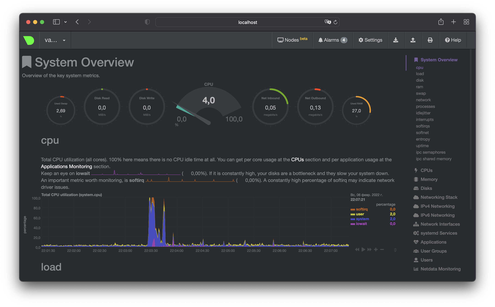

# Домашнее задание
## Домашнее задание к занятию "3.5. Файловые системы"
### Вопрос 2
Не могут.  
Жесткие ссылки на один файл обращаются к одному индексному дескриптору, в котором содержатся метаданные, в том числе права доступа и владелец файла.

### Пункты 4-19
Все пункты выполнены успешно. Листинг убрал в спойлер.

<details>
<summary>Листинг манипуляций с дисками</summary>

```
root@vagrant:~# ls -l /dev/sd*
brw-rw---- 1 root disk 8,  0 Feb  9 17:03 /dev/sda
brw-rw---- 1 root disk 8,  1 Feb  9 17:03 /dev/sda1
brw-rw---- 1 root disk 8,  2 Feb  9 17:03 /dev/sda2
brw-rw---- 1 root disk 8,  3 Feb  9 17:03 /dev/sda3
brw-rw---- 1 root disk 8, 16 Feb  9 17:03 /dev/sdb
brw-rw---- 1 root disk 8, 32 Feb  9 17:03 /dev/sdc
```
```
root@vagrant:~# fdisk -l /dev/sd{b,c}
Disk /dev/sdb: 2.51 GiB, 2684354560 bytes, 5242880 sectors
Disk model: VBOX HARDDISK
Units: sectors of 1 * 512 = 512 bytes
Sector size (logical/physical): 512 bytes / 512 bytes
I/O size (minimum/optimal): 512 bytes / 512 bytes

Disk /dev/sdc: 2.51 GiB, 2684354560 bytes, 5242880 sectors
Disk model: VBOX HARDDISK
Units: sectors of 1 * 512 = 512 bytes
Sector size (logical/physical): 512 bytes / 512 bytes
I/O size (minimum/optimal): 512 bytes / 512 bytes
```
```
root@vagrant:~# fdisk /dev/sdb

Welcome to fdisk (util-linux 2.34).
Changes will remain in memory only, until you decide to write them.
Be careful before using the write command.

Device does not contain a recognized partition table.
Created a new DOS disklabel with disk identifier 0x8fae6fac.

Command (m for help): m

Help:

  DOS (MBR)
   a   toggle a bootable flag
   b   edit nested BSD disklabel
   c   toggle the dos compatibility flag

  Generic
   d   delete a partition
   F   list free unpartitioned space
   l   list known partition types
   n   add a new partition
   p   print the partition table
   t   change a partition type
   v   verify the partition table
   i   print information about a partition

  Misc
   m   print this menu
   u   change display/entry units
   x   extra functionality (experts only)

  Script
   I   load disk layout from sfdisk script file
   O   dump disk layout to sfdisk script file

  Save & Exit
   w   write table to disk and exit
   q   quit without saving changes

  Create a new label
   g   create a new empty GPT partition table
   G   create a new empty SGI (IRIX) partition table
   o   create a new empty DOS partition table
   s   create a new empty Sun partition table

Command (m for help): n
Partition type
   p   primary (0 primary, 0 extended, 4 free)
   e   extended (container for logical partitions)
Select (default p):

Using default response p.
Partition number (1-4, default 1):
First sector (2048-5242879, default 2048):
Last sector, +/-sectors or +/-size{K,M,G,T,P} (2048-5242879, default 5242879): +2G

Created a new partition 1 of type 'Linux' and of size 2 GiB.

Command (m for help): n
Partition type
   p   primary (1 primary, 0 extended, 3 free)
   e   extended (container for logical partitions)
Select (default p):

Using default response p.
Partition number (2-4, default 2):
First sector (4196352-5242879, default 4196352):
Last sector, +/-sectors or +/-size{K,M,G,T,P} (4196352-5242879, default 5242879):

Created a new partition 2 of type 'Linux' and of size 511 MiB.

Command (m for help): w
The partition table has been altered.
Calling ioctl() to re-read partition table.
Syncing disks.
```
```
root@vagrant:~# fdisk -l /dev/sdb
Disk /dev/sdb: 2.51 GiB, 2684354560 bytes, 5242880 sectors
Disk model: VBOX HARDDISK
Units: sectors of 1 * 512 = 512 bytes
Sector size (logical/physical): 512 bytes / 512 bytes
I/O size (minimum/optimal): 512 bytes / 512 bytes
Disklabel type: dos
Disk identifier: 0x8fae6fac

Device     Boot   Start     End Sectors  Size Id Type
/dev/sdb1          2048 4196351 4194304    2G 83 Linux
/dev/sdb2       4196352 5242879 1046528  511M 83 Linux
```
```
root@vagrant:~# sfdisk -d /dev/sdb | sfdisk /dev/sdc
Checking that no-one is using this disk right now ... OK

Disk /dev/sdc: 2.51 GiB, 2684354560 bytes, 5242880 sectors
Disk model: VBOX HARDDISK
Units: sectors of 1 * 512 = 512 bytes
Sector size (logical/physical): 512 bytes / 512 bytes
I/O size (minimum/optimal): 512 bytes / 512 bytes

>>> Script header accepted.
>>> Script header accepted.
>>> Script header accepted.
>>> Script header accepted.
>>> Created a new DOS disklabel with disk identifier 0x8fae6fac.
/dev/sdc1: Created a new partition 1 of type 'Linux' and of size 2 GiB.
/dev/sdc2: Created a new partition 2 of type 'Linux' and of size 511 MiB.
/dev/sdc3: Done.

New situation:
Disklabel type: dos
Disk identifier: 0x8fae6fac

Device     Boot   Start     End Sectors  Size Id Type
/dev/sdc1          2048 4196351 4194304    2G 83 Linux
/dev/sdc2       4196352 5242879 1046528  511M 83 Linux

The partition table has been altered.
Calling ioctl() to re-read partition table.
Syncing disks.
```
```
root@vagrant:~# mdadm --create --verbose /dev/md0 --level=1 --raid-devices=2 /dev/sdb1 /dev/sdc1
mdadm: Note: this array has metadata at the start and
    may not be suitable as a boot device.  If you plan to
    store '/boot' on this device please ensure that
    your boot-loader understands md/v1.x metadata, or use
    --metadata=0.90
mdadm: size set to 2094080K
Continue creating array? y
mdadm: Defaulting to version 1.2 metadata
mdadm: array /dev/md0 started.
```
```
root@vagrant:~# mdadm --create --verbose /dev/md1 --level=0 --raid-devices=2 /dev/sdb2 /dev/sdc2
mdadm: chunk size defaults to 512K
mdadm: Defaulting to version 1.2 metadata
mdadm: array /dev/md1 started.
```
```
root@vagrant:~# cat /proc/mdstat
Personalities : [linear] [multipath] [raid0] [raid1] [raid6] [raid5] [raid4] [raid10]
md1 : active raid0 sdc2[1] sdb2[0]
      1042432 blocks super 1.2 512k chunks

md0 : active raid1 sdc1[1] sdb1[0]
      2094080 blocks super 1.2 [2/2] [UU]

unused devices: <none>
```
```
root@vagrant:~# pvcreate /dev/md0
  Physical volume "/dev/md0" successfully created.
```
```
root@vagrant:~# pvcreate /dev/md1
  Physical volume "/dev/md1" successfully created.
```
```
root@vagrant:~# pvdisplay /dev/md*
  --- Physical volume ---
  PV Name               /dev/md0
  VG Name               vg1
  PV Size               <2.00 GiB / not usable 0
  Allocatable           yes
  PE Size               4.00 MiB
  Total PE              511
  Free PE               511
  Allocated PE          0
  PV UUID               XhdUfU-dtn1-U67c-TvHQ-EUJd-d7c1-4datCp

  --- Physical volume ---
  PV Name               /dev/md1
  VG Name               vg1
  PV Size               1018.00 MiB / not usable 2.00 MiB
  Allocatable           yes
  PE Size               4.00 MiB
  Total PE              254
  Free PE               254
  Allocated PE          0
  PV UUID               kjYoXX-GQM1-4Te6-Z0kB-etF3-RbuT-s4X59m
```
```
root@vagrant:~# vgcreate vg0 /dev/md0 /dev/md1
  Volume group "vg0" successfully created
```
```
root@vagrant:~# vgdisplay vg0
  --- Volume group ---
  VG Name               vg0
  System ID
  Format                lvm2
  Metadata Areas        2
  Metadata Sequence No  1
  VG Access             read/write
  VG Status             resizable
  MAX LV                0
  Cur LV                0
  Open LV               0
  Max PV                0
  Cur PV                2
  Act PV                2
  VG Size               <2.99 GiB
  PE Size               4.00 MiB
  Total PE              765
  Alloc PE / Size       0 / 0
  Free  PE / Size       765 / <2.99 GiB
  VG UUID               tSz7TO-zggj-PK8j-q8bV-3jfi-uNwf-e6fJhm
```
```
root@vagrant:~# lvcreate -L 100M vg0 /dev/md1
  Logical volume "lvol0" created.
```
```
root@vagrant:~# lvdisplay /dev/vg0/lvol0
  --- Logical volume ---
  LV Path                /dev/vg0/lvol0
  LV Name                lvol0
  VG Name                vg0
  LV UUID                FJJB7H-NVFf-M9XB-2Idc-bokJ-NQDN-S7s4EB
  LV Write Access        read/write
  LV Creation host, time vagrant, 2022-02-09 17:53:24 +0000
  LV Status              available
  # open                 1
  LV Size                100.00 MiB
  Current LE             25
  Segments               1
  Allocation             inherit
  Read ahead sectors     auto
  - currently set to     4096
  Block device           253:1
```
```
root@vagrant:~# mkfs.ext4 /dev/vg0/lvol0
mke2fs 1.45.5 (07-Jan-2020)
Creating filesystem with 25600 4k blocks and 25600 inodes

Allocating group tables: done
Writing inode tables: done
Creating journal (1024 blocks): done
Writing superblocks and filesystem accounting information: done
```
```
root@vagrant:~# mkdir /tmp/test
root@vagrant:~# mount /dev/vg0/lvol0 /tmp/test
```
```
root@vagrant:~# wget https://mirror.yandex.ru/ubuntu/ls-lR.gz -O /tmp/test/test.gz
--2022-02-09 18:05:22--  https://mirror.yandex.ru/ubuntu/ls-lR.gz
Resolving mirror.yandex.ru (mirror.yandex.ru)... 213.180.204.183, 2a02:6b8::183
Connecting to mirror.yandex.ru (mirror.yandex.ru)|213.180.204.183|:443... connected.
HTTP request sent, awaiting response... 200 OK
Length: 22289246 (21M) [application/octet-stream]
Saving to: ‘/tmp/test/test.gz’

/tmp/test/test.gz             100%[=================================================>]  21.26M  1.77MB/s    in 13s

2022-02-09 18:05:36 (1.60 MB/s) - ‘/tmp/test/test.gz’ saved [22289246/22289246]
```
```
root@vagrant:~# ls -lh /tmp/test/test.gz
-rw-r--r-- 1 root root 22M Feb  9 16:17 /tmp/test/test.gz
```
```
root@vagrant:~# lsblk
NAME                      MAJ:MIN RM  SIZE RO TYPE  MOUNTPOINT
loop0                       7:0    0 55.4M  1 loop  /snap/core18/2128
loop1                       7:1    0 70.3M  1 loop  /snap/lxd/21029
loop2                       7:2    0 32.3M  1 loop  /snap/snapd/12704
loop3                       7:3    0 55.5M  1 loop  /snap/core18/2284
loop4                       7:4    0 43.4M  1 loop  /snap/snapd/14549
loop5                       7:5    0 61.9M  1 loop  /snap/core20/1328
loop6                       7:6    0 67.2M  1 loop  /snap/lxd/21835
sda                         8:0    0   64G  0 disk
├─sda1                      8:1    0    1M  0 part
├─sda2                      8:2    0    1G  0 part  /boot
└─sda3                      8:3    0   63G  0 part
  └─ubuntu--vg-ubuntu--lv 253:0    0 31.5G  0 lvm   /
sdb                         8:16   0  2.5G  0 disk
├─sdb1                      8:17   0    2G  0 part
│ └─md0                     9:0    0    2G  0 raid1
└─sdb2                      8:18   0  511M  0 part
  └─md1                     9:1    0 1018M  0 raid0
    └─vg0-lvol0           253:1    0  100M  0 lvm   /tmp/test
sdc                         8:32   0  2.5G  0 disk
├─sdc1                      8:33   0    2G  0 part
│ └─md0                     9:0    0    2G  0 raid1
└─sdc2                      8:34   0  511M  0 part
  └─md1                     9:1    0 1018M  0 raid0
    └─vg0-lvol0           253:1    0  100M  0 lvm   /tmp/test
```
```
root@vagrant:~# gzip -t /tmp/test/test.gz
root@vagrant:~# echo $?
0
```
```
root@vagrant:~# pvmove /dev/md1 /dev/md0
  /dev/md1: Moved: 32.00%
  /dev/md1: Moved: 100.00%
```
```
root@vagrant:~# mdadm --fail /dev/md0 /dev/sdb1
mdadm: set /dev/sdb1 faulty in /dev/md0
```
```
root@vagrant:~# dmesg -T | tail -2
[Wed Feb  9 18:19:14 2022] md/raid1:md0: Disk failure on sdb1, disabling device.
                           md/raid1:md0: Operation continuing on 1 devices.
```
```
root@vagrant:~# cat /proc/mdstat
Personalities : [linear] [multipath] [raid0] [raid1] [raid6] [raid5] [raid4] [raid10]
md1 : active raid0 sdc2[1] sdb2[0]
      1042432 blocks super 1.2 512k chunks

md0 : active raid1 sdc1[1] sdb1[0](F)
      2094080 blocks super 1.2 [2/1] [_U]

unused devices: <none>
```
```
root@vagrant:~# gzip -t /tmp/test/test.gz
root@vagrant:~# echo $?
0
```
</details>

---

## Домашнее задание к занятию "3.4. Операционные системы, лекция 2"
### Вопрос 1
Создал unit-файл для node_exporter, учел возможность добавления опций к запускаемому процессу через внешний файл и поместил unit в автозагрузку

`sudo systemctl cat node_exporter`
```
# /etc/systemd/system/node_exporter.service
[Unit]
Description=Prometheus exporter for hardware and OS metrics exposed by *NIX kernels
Documentation=https://prometheus.io/docs/guides/node-exporter/
After=network.target

[Service]
ExecStart=/opt/node_exporter/bin/node_exporter $EXT_OPTS
EnvironmentFile=-/etc/opt/node_exporter/options
KillMode=process
Restart=on-failure

[Install]
WantedBy=multi-user.target
```
`cat /etc/opt/node_exporter/options`
```
EXT_OPTS="--collector.tcpstat"
``` 

`sudo systemctl status node_exporter`
```
● node_exporter.service - Prometheus exporter for hardware and OS metrics exposed by *NIX kernels
     Loaded: loaded (/etc/systemd/system/node_exporter.service; enabled; vendor preset: enabled)
     Active: active (running) since Sun 2022-02-06 08:30:16 PST; 1min 50s ago
       Docs: https://prometheus.io/docs/guides/node-exporter/
   Main PID: 713 (node_exporter)
      Tasks: 3 (limit: 1055)
     Memory: 13.6M
     CGroup: /system.slice/node_exporter.service
             └─713 /opt/node_exporter/bin/node_exporter --collector.tcpstat
```
### Вопрос 2
По умолчанию включены все необходимые метрики для мониторинга процессора, памяти, диска и сети.  
Можно включить сборщик tcpstat (—collector.tcpstat)

`curl -s http://localhost:9100/metrics | grep tcp`
```
node_scrape_collector_duration_seconds{collector="tcpstat"} 0.000354582
node_scrape_collector_success{collector="tcpstat"} 1
# HELP node_tcp_connection_states Number of connection states.
# TYPE node_tcp_connection_states gauge
node_tcp_connection_states{state="established"} 3
node_tcp_connection_states{state="listen"} 6
node_tcp_connection_states{state="rx_queued_bytes"} 0
node_tcp_connection_states{state="tx_queued_bytes"} 0
```

### Вопрос 3
Установил netdata и ознакомился с метриками


### Вопрос 4
В выводе dmesg есть сообщение об обнаружении виртуализации

`dmesg -T | grep virtual`
```
[Sat Feb  5 07:21:35 2022] systemd[1]: Detected virtualization parallels.
```

### Вопрос 5
Максимальное количество файловых дескрипторов, которые может открыть процесс

`sysctl -a | grep fs.nr_open`
```
fs.nr_open = 1048576
```

Другой лимит – **ulimit -n** (the maximum number of open file descriptors)

`ulimit -a | grep open`
```
open files                      (-n) 1024
```

### Вопрос 6
`ps a`
```
    PID TTY      STAT   TIME COMMAND
      1 pts/0    S+     0:00 sleep 1h
      2 pts/1    S      0:00 -bash
     24 pts/1    R+     0:00 ps a
```

### Вопрос 7
Это форк-бомба

`dmesg -T | tail -1`
```
[Sat Feb  5 11:45:36 2022] cgroup: fork rejected by pids controller in /user.slice/user-1000.slice/session-22.scope
```

cgroup - механизм ядра Linux, который изолирует и ограничивает использование ресурсов группе процессов.

https://www.kernel.org/doc/Documentation/cgroup-v1/pids.txt  
Process Number Controller  
The process number controller is used to allow a cgroup hierarchy to stop any new tasks from being fork()'d or clone()'d after a certain limit is reached.  
Since it is trivial to hit the task limit without hitting any kmemcg limits in place, PIDs are a fundamental resource. As such, PID exhaustion must be preventable in the scope of a cgroup hierarchy by allowing resource limiting of the number of tasks in a cgroup.

`ulimit -a | grep process`
```
max user processes              (-u) 3421
```
`ulimit -u `

---

## Домашнее задание к занятию "3.3. Операционные системы, лекция 1"

1. chdir()
2. /usr/share/misc/magic.mgc  
Дополнительно использовал `man file` и `man magic`  
3. Посмотреть файловый дескриптор файла с логом  
`lsof -p <PID> | grep file.log`  
Очистить содержимое командой:  
`cat /dev/null >/proc/<PID>/fd/3`  
Место на диске освобождается, проверено командой `df -h`. Хотя поле SIZE в `lsof -p <PID> -s | grep file.log` не обнуляется.  
4. Зомби-процессы не занимают ресурсы, но блокируют записи в таблице процессов, размер которой ограничен для каждого пользователя и системы в целом.
5. `sudo opensnoop-bpfcc -d 1`  
/proc/interrupts  
/proc/stat  
/proc/irq/20/smp_affinity  
/proc/irq/0/smp_affinity  
/proc/irq/1/smp_affinity  
/proc/irq/8/smp_affinity  
/proc/irq/12/smp_affinity  
/proc/irq/14/smp_affinity  
/proc/irq/15/smp_affinity   
6. uname()  
Part of the utsname information is also accessible via /proc/sys/kernel/{ostype, hostname, osrelease, version, domainname}.
7. При использовании `;` команды выполняются последовательно в порядке очереди, возвращается статус последней выполненной команды.  
При использовании `&&` следующая команда выполняется в случае успешного завершения предыдущей команды (статус 0). Возвращается статус последней выполненной команды в списке.  
`set -e` — немедленный выход из оболочки, если команда завершилась с ошибкой.  
Выход из оболочки не выполняется, если (но не только при этом) команда завершилась с ненулевым кодом, которая является частью любой команды, выполняемой в списке через &&, за исключением команды, следующей за конечным символом &&  
Поэтому при определенных условиях имеет смысл использовать `&&` с примененным `set -e`  
8. `set -euxo pipefail`  
**-e** разобран в предыдущем ответе  
**-u** Считать неустановленные переменные и параметры, отличные от специальных параметров "@" и "*", ошибкой при расширении параметров. При попытке раскрытия неустановленной переменной или параметра оболочка печатает сообщение об ошибке и, если не интерактивна, завершает работу с ненулевым статусом.  
**-x** После расширения каждой простой команды, для команды, команды case, команды выбора или арифметики для команды, отобразите расширенное значение PS4, за которым следует команда и ее расширенные аргументы или связанный список слов.  
**-o pipefail** Если установлено, возвращаемое значение конвейера — это значение последней (самой правой) команды для выхода с ненулевым статусом или ноль, если все команды в конвейере завершаются успешно. Эта опция отключена по умолчанию.
9. `ps axo stat --sort=stat | grep -v STAT | cut -c-1 | uniq -c | sort -r`  
     69 S  
     46 I  
      1 R  
Наиболее часто встречается статус S - interruptible sleep (waiting for an event to complete)

##Домашнее задание к занятию "3.2. Работа в терминале, лекция 2"
1. `type cd`  
cd is a shell builtin  
Команда cd выполняется в самой оболочке, не порождает новый процесс.  
Команда выбирает рабочую директорию оболочки, поэтому логично, что команда выполняется внутри этой оболочки.
2. `grep -c <some_string> <some_file>`
3. systemd
4. `ls /empty 2>/dev/pts/X`
5. `cat <file1 >file2`
6. `echo "pew pew" >/dev/tty1`
7. Командой `bash 5>&1` создан новый файловый дескриптор с выводом на stdout, т.е. на терминал данной сессии /proc/$$/fd5 -> /dev/pts/X  
echo `netology > /proc/$$/fd/5` выведет сообщение в терминал текущей сессии
8. `cat file 2>&1 >&5 | wc -w`  
Перенаправляем stderr в stdout, а stdout в fd5 -> /dev/pts/X
9. Файл /proc/$$/environ содержит начальные переменные окружения  
Аналогичный вывод можно получить командой `env`
10. /proc/\<PID\>/cmdline  
Файл содержит полную командную строку запуска процесса, кроме зомби-процесса  
/proc/\<PID\>/exe  
В Linux 2.2 и более поздних версиях этот файл представляет собой символическую ссылку, содержащую фактический путь к выполняемой команде.  
В Linux 2.0 и более ранних версиях - является указателем на исполняемый двоичный файл и отображается как символическая ссылка.
11. `grep sse /proc/cpuinfo`  
Мой процессор не поддерживает набор инструкций SSE
12. При выполнении команды по ssh не открывается новый терминал, поэтому не выделяется pty  
Можно добавить ключ -t  
`ssh -t localhost 'tty'`  
vagrant@localhost's password:  
/dev/pts/1
13. reptyr \<PID\>
14. tee - читает из стандартного ввода и записывает в стандартный вывод и файлы  
Перенаправлением занимается процесс shell'а, который запущен без sudo под вашим пользователем, а tee записывает в файл и его можно вызвать с sudo


##Домашнее задание к занятию "3.1. Работа в терминале, лекция 1"

1. Установил **Parallels**
2. Установил Vagrant + плагин Parallels  
`vagrant plugin list`  
vagrant-parallels (2.2.4, global)
3. \+
4. Использовал `config.vm.box = "bento/ubuntu-20.04-arm64"`
5. Процессор: 2 CPU  
Память: 1024 MB  
Дисковое пространство: 64 GB
6. Для добавления оперативной памяти или процессора ВМ необходимо добавить в Vagrantfile строчки и перезагрузить ВМ:  
`config.vm.provider "virtualbox" do |v|`  
`  v.memory = [ram_size]`  
`  v.cpus = [cpu]`  
`end`
7. \+
8. Длина журнала **history** описывается переменными:  
line 937 HISTFILESIZE - максимальное количество строк  
line 955 HISTSIZE - количество команд  
ignoreboth - значение опции HISTCONTROL, включает в себя:  
ignorespace - не сохранять в истории команды, начинающиеся с пробела  
ignoredups - не сохранять строку, если она совпадает с предыдущей  
9. Символы **{}** используются в составных командах, когда необходимо выполнить команды в текущей оболочке.  
line 287
10. `touch file{1..100000}`  
Предварительно увеличить размер стека  
`ulimit -s 65536`  
`touch file{1..300000}`  
`ls -l file* | wc`  
 300000 2700000 16388895
11. `[[ -d /tmp ]]`  
Возвращает истину, если существует директория /tmp  
**[[ ]]** - проверяется условие внутри и возвращается 0 или 1  
**-d** — истина, если файл существует и это директория
12. `type -a bash`  
bash is /usr/bin/bash  
bash is /bin/bash  
`echo $PATH`  
/usr/local/sbin:/usr/local/bin:/usr/sbin:/usr/bin:/sbin:/bin:/usr/games:/usr/local/games:/snap/bin  
`mkdir /tmp/new_path_directory`  
`cp /usr/bin/bash /tmp/new_path_directory`  
`PATH=/tmp/new_path_directory/:$PATH`  
`type -a bash`  
bash is /tmp/new_path_directory/bash  
bash is /usr/bin/bash  
bash is /bin/bash
13. **at** выполняет команды в указанное время.  
**batch** выполняет команды, когда load average падает ниже 1,5 или значения, указанного при вызове atd (`atd [-l load_avg]`).
14. \+


##Домашнее задание к занятию «2.4. Инструменты Git»
1. `git show aefea`\
commit aefead2207ef7e2aa5dc81a34aedf0cad4c32545\
Update CHANGELOG.md
2. `git show 85024d3`\
tag: v0.12.23
3. `git show b8d720` или `git show b8d720^` и `git show b8d720^2`\
У коммита b8d720 2 родителя:\
commit 56cd7859e05c36c06b56d013b55a252d0bb7e158\
commit 9ea88f22fc6269854151c571162c5bcf958bee2b
4. `git log v0.12.23..v0.12.24 --pretty=format:'%h %s'`\
b14b74c49 [Website] vmc provider links\
3f235065b Update CHANGELOG.md\
6ae64e247 registry: Fix panic when server is unreachable\
5c619ca1b website: Remove links to the getting started guide's old location\
06275647e Update CHANGELOG.md\
d5f9411f5 command: Fix bug when using terraform login on Windows\
4b6d06cc5 Update CHANGELOG.md\
dd01a3507 Update CHANGELOG.md\
225466bc3 Cleanup after v0.12.23 release
5. `git log -S 'func providerSource(' --oneline`\
8c928e835
6. Сначала найдем в каком файле определена функция globalPluginDirs\
`git grep 'func globalPluginDirs('`\
plugins.go\
Далее найдем коммиты, где была изменена функция в этом файле\
`git log -L :globalPluginDirs:plugins.go --oneline`\
78b122055\
52dbf9483\
41ab0aef7\
66ebff90c\
8364383c3
7. `git log -S 'func synchronizedWriters(' --pretty=format:'%h %an <%ae>' | tail -1`\
5ac311e2a Martin Atkins <mart@degeneration.co.uk>
